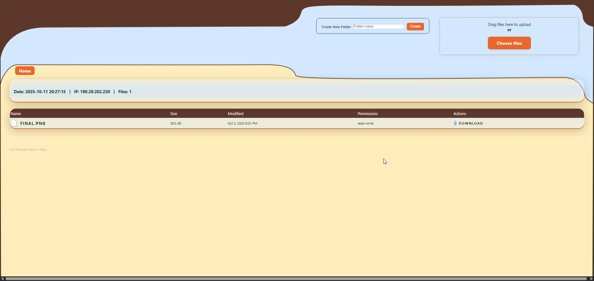

##📂 File Manager PHP – Bexart Edition

Un gestor de archivos PHP completamente funcional, con una interfaz moderna, soporte para carga de archivos, creación de carpetas, descargas, y navegación dentro del servidor.
Incluye un diseño estilizado con colores personalizados y adaptado para dispositivos móviles (responsive).

---

---

## ✨ Vista previa



--- 

##🚀 Características Principales

🗂️ Exploración de carpetas y archivos dentro del servidor.

📤 Subida de archivos con restricción de extensiones no permitidas.

📁 Creación de carpetas directamente desde la interfaz.

📥 Descarga directa de archivos individuales.

👁️ Vista directa (preview) de imágenes, PDFs y otros tipos de archivos.

🔒 Protección XSRF para seguridad en peticiones POST.

🧱 Diseño adaptable (Responsive): convierte la tabla en tarjetas en pantallas pequeñas.

---

##🎨 Tema visual personalizado con paleta de colores:

Cal Poly Green #26422A
Flame #EA672D
Bistre #5D372A
Columbia Blue translúcido rgba(210, 232, 255, 0.4)

---

##⚙️ Configuración Inicial

Edita las siguientes opciones en la parte superior del archivo PHP:

$allow_delete = false;     // Permite eliminar archivos

$allow_upload = true;      // Permite subir archivos

$allow_create_folder = true; // Permite crear carpetas

$allow_direct_link = true; // Permite abrir archivos directamente

$allow_show_folders = true; // Muestra subdirectorios

$disallowed_extensions = ['php']; // Bloquea subidas peligrosas

$hidden_extensions = ['php'];     // Oculta archivos PHP

$PASSWORD = ''; // (Opcional) contraseña para acceder


---

##💡 Si deseas proteger el acceso al gestor, establece una contraseña:

$PASSWORD = 'MiClaveSegura123';

---

##🧩 Estructura y Funciones Clave

get_absolute_path() → Evita rutas relativas o salidas del directorio raíz.

is_entry_ignored() → Oculta archivos o carpetas según reglas definidas.

rmrf() → Elimina archivos y carpetas recursivamente (si está habilitado).

asBytes() → Convierte valores de configuración (2M, 512K, etc.) a bytes reales.

showfile → Permite mostrar archivos directamente en el navegador.

---

##🧠 Seguridad

El sistema incluye varias capas de protección:

Bloqueo de archivos .php en subidas.

Prevención de traversal (../).

Token XSRF para acciones sensibles.

Opción de proteger el acceso por contraseña.

Bloqueo opcional de eliminación de archivos.

---

##📱 Diseño Responsive

En móviles y tablets:

La tabla de archivos se convierte automáticamente en tarjetas.

Los nombres de las columnas se muestran como etiquetas (data-label).

Mantiene un diseño claro y legible con sombra y espaciado.

---

##📸 Personalización Visual

Fondo: final.png (puedes reemplazarlo por cualquier imagen).

Colores adaptados a la identidad visual de Bexart.

Botones con efectos de sombra y transición al pasar el mouse.

Formularios compactos con bordes redondeados y acentos Flame (#EA672D).

---

##🧰 Requisitos

Servidor con PHP 7.4 o superior.

Extensiones habilitadas:

fileinfo

openssl

json

---

##🔧 Instalación

Copia el archivo index.php en el servidor o carpeta que quieras administrar.

(Opcional) Agrega la imagen final.png para el fondo.


---

##¡Listo! Ya puedes navegar, subir archivos y gestionar tus carpetas.

---

##🧾 Licencia

Este proyecto se distribuye libremente para uso personal o comercial.
Puedes modificarlo según tus necesidades, pero se recomienda mantener las medidas de seguridad integradas.


Abre el archivo desde tu navegador:

   ```bash
   http://tusitio.com/gestor/index.php

